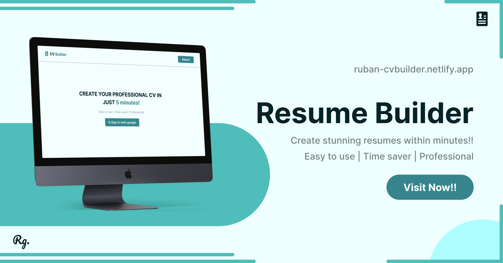

# 📄 Resume Builder Web Application 🚀

The Resume Builder Web Application is an innovative tool that simplifies the process of creating professional resumes. Say goodbye to the hassle of formatting and design, and say hello to user-friendly interface that enables you to create impressive resumes with ease. 

**Website Link: [Resume Builder Web Application](https://ruban-cvbuilder.netlify.app/)**

## 🌟 Features

### Support Me By Starring ⭐ Some Of My Repositories

Click below to gift a book to me.

**Thank You!!**

